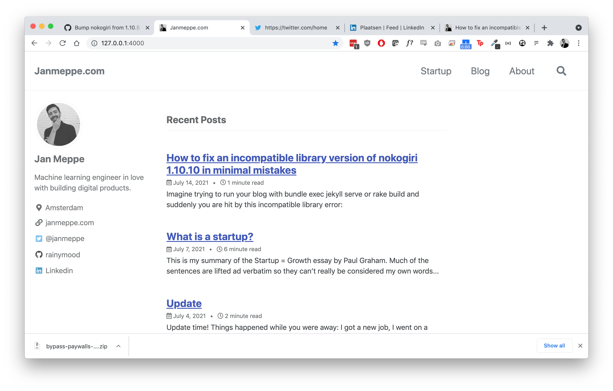

# Janmeppe.com



This repository contains the code, text, and assets of my personal blog which
you can find here at [www.janmeppe.com](www.janmeppe.com). 

## Installation

Clone the repo

```
git clone https://github.com/Rainymood/rainymood.github.io
```

Assuming you have a working installation of [Ruby](https://www.ruby-lang.org/en/downloads/), install the bundler

```
gem install bundler
```

And install all the gems

```
bundle install
```

## Running the blog (Mac)

Run the blog with

```ruby
rake build
```

Usually we would run the blog using `bundle exec jekyll serve` or simply `build`.

This is a workaround due to a unicode error/bug that I still haven't fixed which you can read more about here:

* [Invalid US-ASCII character “\xE2” on line 54 workaround](https://www.janmeppe.com/blog/invalid-US-ASCII-character/)

## Running the blog (Windows)

Run the blog with 

```
bundle exec jekyll serve --livereload -o --drafts --future
```
## Writing posts

To write: 

* drafts put **undated** posts in the `_drafts/` folder.
* blog posts put **dated** posts in the `_posts/` folder. 

Put all assets in `assets/` in a folder with the same name. 

If you want to see the drafts, serve build/serve Jekyll with the `--draft` flag enabled. 

This flag is by default enabled if you run the blog with `rake build`. 

## Writing posts (in the future)

I want to move towards a workflow where I use branches. I think I want a `draft` branch where I can fuck around and then once I'm done I can just pull it to the main one using a pull request. This would clean up my `main` branch a lot. 

## Q: How to view your bundler version?

```
cat Gemfile.lock | grep -A 1 "BUNDLED WITH"
BUNDLED WITH
   1.17.3

gem install bundler -v '1.17.3'
```

## Q: How to override settings

Change the settings in `assets/css/main.scss`.

## Q: How to change your home page?

Change settings in `index.html`.

## Q: How to uninstall all gems?

```
gem uninstall -aIx
```

## Q: How to resolve incompatible ruby gems

```
ruby_dep-1.5.0 requires ruby version >= 2.2.5, ~> 2.2, which is incompatible
with the current version, ruby 3.0.2p107
```

`bundle update`

## Q: How to solve cannot load such file (LoadError)

```
λ bundle exec jekyll serve
...
C:/Ruby30-x64/lib/ruby/gems/3.0.0/gems/jekyll-3.9.0/lib/jekyll/commands/serve/servlet.rb:3:in `require': cannot load such file -- webrick (LoadError)
```

`bundle add webrick`

## Q: How to resolve cannot load such file rubyeventmachine (LoadError)

```
Unable to load the EventMachine C extension; To use the pure-ruby reactor, require 'em/pure_ruby'
C:/Ruby30-x64/lib/ruby/gems/3.0.0/gems/eventmachine-1.2.7-x64-mingw32/lib/rubyeventmachine.rb:2:in `require': cannot load such file -- 3.0/rubyeventmachine (LoadError)
...
```

```
gem uninstall eventmachine 
gem 'eventmachine', '1.2.7', git: 'https://github.com/eventmachine/eventmachine.git', tag: 'v1.2.7'
bundle install
bundle exec jekyll
```

See: https://stackoverflow.com/a/65547010

## Resources

* [Minimal mistakes (Jekyll theme used)](https://mmistakes.github.io/minimal-mistakes/)
* [Configuration options](https://mmistakes.github.io/minimal-mistakes/docs/configuration/)
