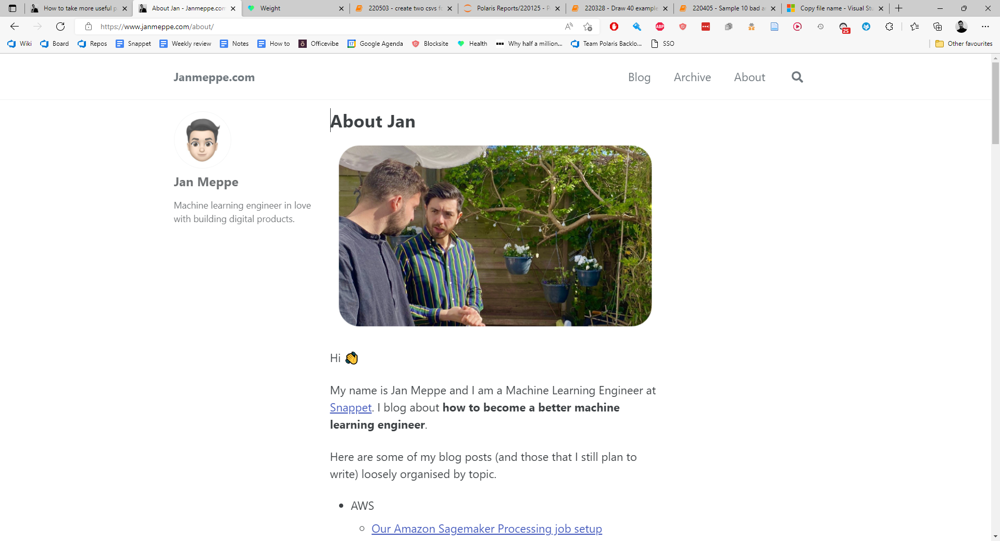

# Janmeppe.com



This repository contains the code, text, and assets of my personal blog which
you can find here at [www.janmeppe.com](www.janmeppe.com). 

## Installation

Clone the repo

```
git clone https://github.com/Rainymood/rainymood.github.io
```

Assuming you have a working installation of [Ruby](https://www.ruby-lang.org/en/downloads/), install the bundler

```
gem install bundler
```

And install all the gems

```
bundle install
```

If this is the first time you are setting up the blog on a new computer. Generate a new
Personal Access Token (PAT) [here](https://github.com/settings/tokens).

## Running the blog (Mac)

Run the blog with

```ruby
rake build
```

Usually we would run the blog using `bundle exec jekyll serve` or simply `build`.

This is a workaround due to a unicode error/bug that I still haven't fixed which you can read more about here:

* [Invalid US-ASCII character “\xE2” on line 54 workaround](https://www.janmeppe.com/blog/invalid-US-ASCII-character/)

## Running the blog (Windows)

Run the blog with 

```
bundle exec jekyll serve --livereload -o --drafts --future
```
## Writing posts

Switch to a new branch. For example,

```bash
git checkout -b 220520-new-post
```

Run `new-post.py`

```
Input name of title (ctrl + C to cancel): dan harmon writing advice
foldername:  2022-05-20-dan-harmon-writing-advice
filename:  2022-05-20-dan-harmon-writing-advice.md
Successfully created assets\2022-05-20-dan-harmon-writing-advice
Successfully created _posts\2022-05-20-dan-harmon-writing-advice.md
```

Start writing, push to this branch, once you are done make a PR to the main branch and (squash) merge it in. 

## Changing the styling

Edit `assets\css\main.scss`

## Docs

I have some docs that I keep in the `docs/` folder. Run and autobuild with:

```bash
sphinx-autobuild docs docs/_build/html
```

## FAQ

Some common issues and solutions can be found in [FAQ.md](FAQ.md).

## Resources

* [Minimal mistakes (Jekyll theme used)](https://mmistakes.github.io/minimal-mistakes/)
* [Configuration options](https://mmistakes.github.io/minimal-mistakes/docs/configuration/)
* [Justin Rummel](https://www.justinrummel.com/page3/): I need to figure out how this guy added pictures 
* https://www.fabriziomusacchio.com/blog/
  * Simple view is awesome
  * Has images

## Kanban board

https://trello.com/b/Re16gCSo/janmeppecom

## Cool: Small buttons

[This PR](https://github.com/Rainymood/rainymood.github.io/pull/41/commits/ed26137516a172311bc2c8e114a96101a41d56ac) adds small buttons like this:


## Blue used

`#1da1f2`

## Tail for `cat readme.md`

I should probably make an alias for this but I'm too lazy so I usually do `cat readme.md` and then copy paste this command to start my blog locally.

The `--incremental` flag is a lifesaver. 

```
bundle exec jekyll serve --livereload -o --incremental
```


``` bundle exec jekyll serve --livereload -o --incremental --limit_posts
```